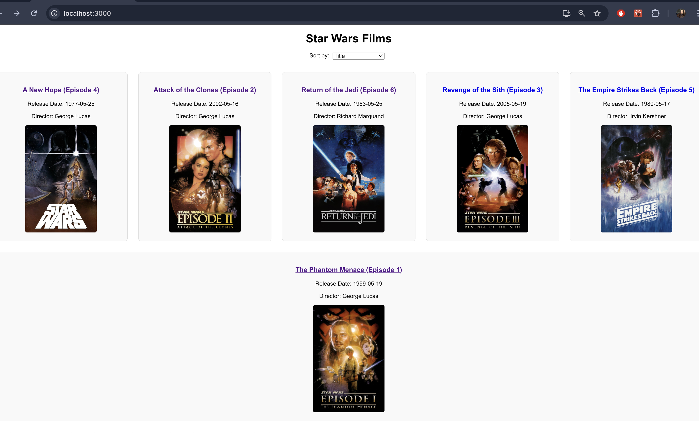
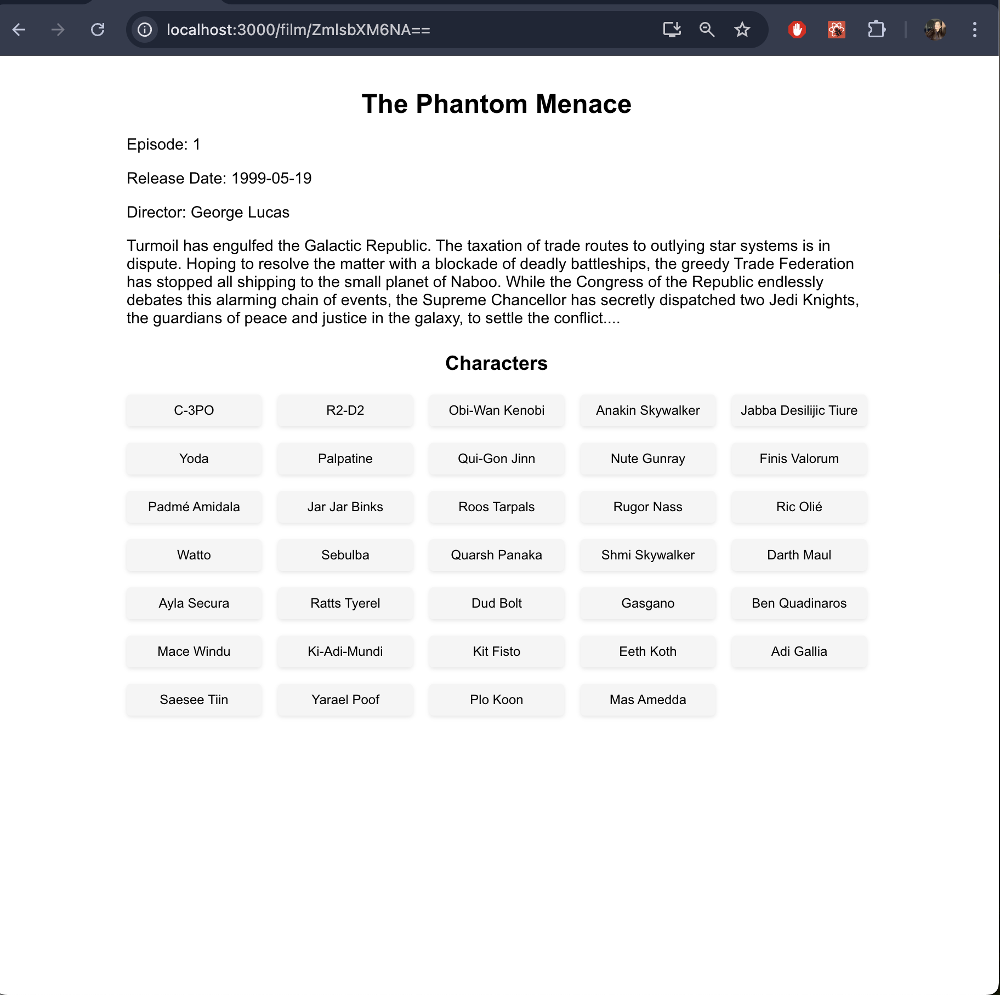
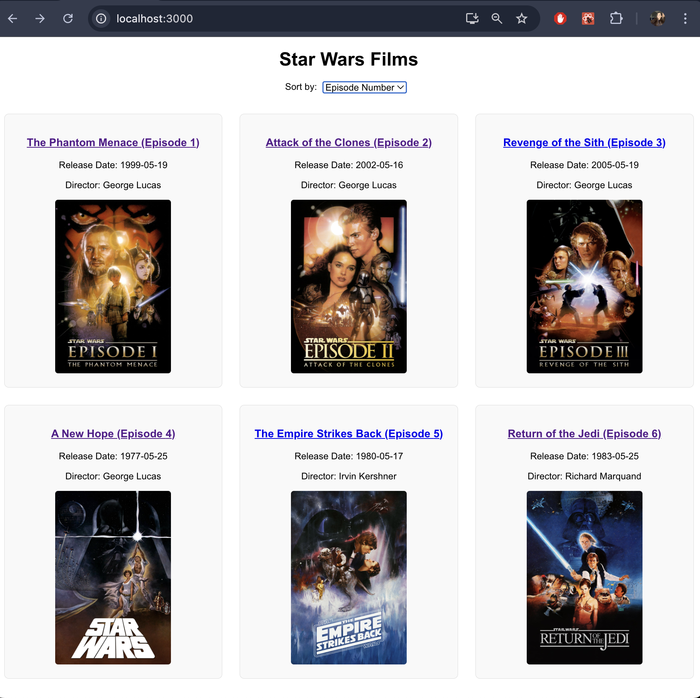
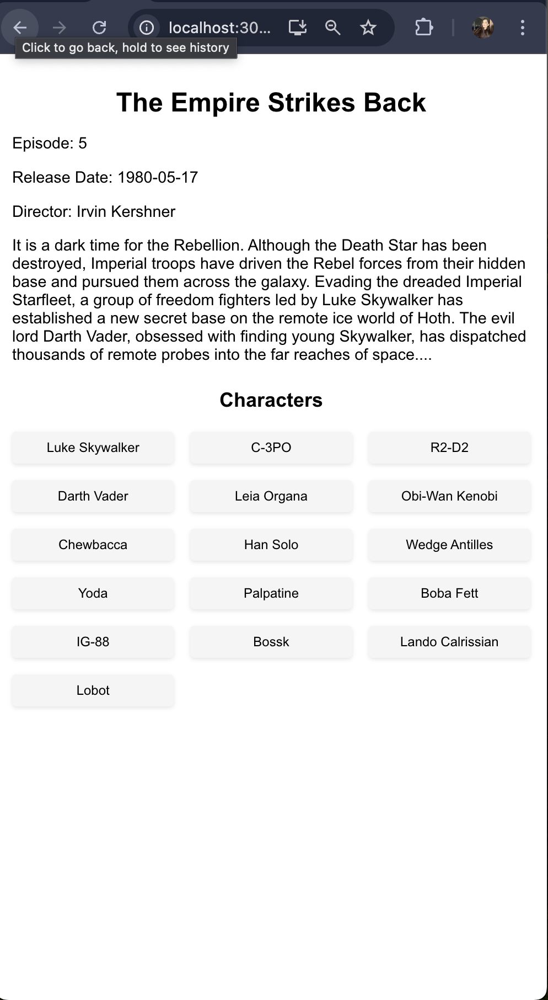

# Project Overview

This project is a React web application that displays a list of Star Wars films using GraphQL and data from the Star Wars API. The app allows users to view details about each film, including its title, release date, director, episode number, and the list of characters. The app also includes sorting functionality and responsive design to ensure usability across different devices.

## Features
Display Film Data: Fetches and displays a list of Star Wars films using GraphQL.

Each film shows its title, release date, director, and episode number.
Sort Films: Users can sort the films by title, release date, or episode number.

Film Detail Page: Detailed information about each film, including the opening crawl and list of characters.

Responsive Design: Ensures the app is usable on various devices, from desktops to mobile screens.

Error Handling: Displays error messages if data retrieval fails.

Manual Posters: Display of Star Wars posters, added manually by linking URLs

## Dependencies
This project uses the following dependencies:

React: A JavaScript library for building user interfaces.
Apollo Client: A state management library for JavaScript apps to interact with a GraphQL API.
React Router: Handles routing in the app to navigate between the list and detail views.
GraphQL: For querying the Star Wars films data.
You can find all the dependencies listed in the package.json file.
### Installation and Setup
Follow these steps to run the project locally on your machine:

1. Clone the Repository

git clone https://github.com/shafaqs/star-wars-films.git
cd star-wars-films
2. Install Dependencies
Make sure you have Node.js installed. Then run the following command to install all required packages:

npm install
3. Start the Development Server
Once the dependencies are installed, run the following command to start the app:

### `npm start`
The application will be running at http://localhost:3000/.

Running the Application
Navigate to the Film List: Upon opening the app, you'll see a list of Star Wars films. You can sort the films by title, release date, or episode number using the dropdown at the top.

View Film Details: Click on any film to view detailed information about it, including the characters and the opening crawl.

Error Handling: If there's an issue fetching data from the API, a friendly error message will be displayed.

The page will reload when you make changes.
You may also see any lint errors in the console.

